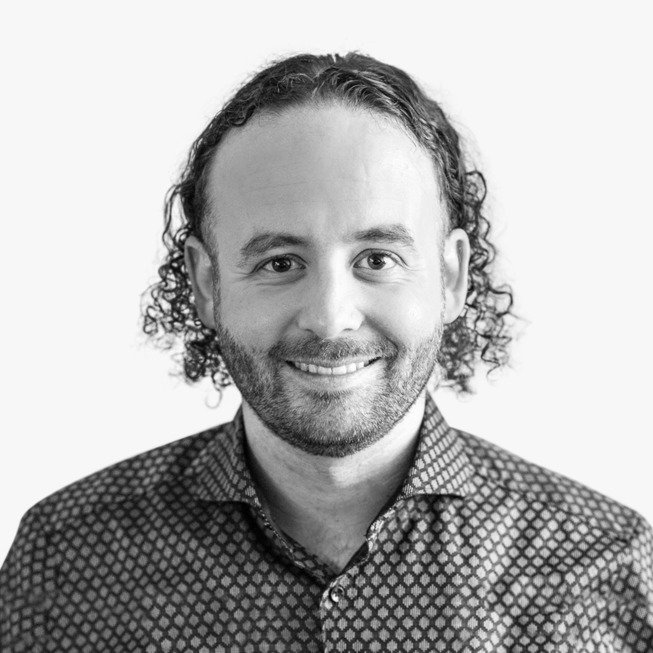
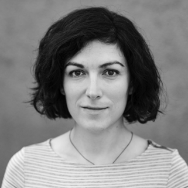
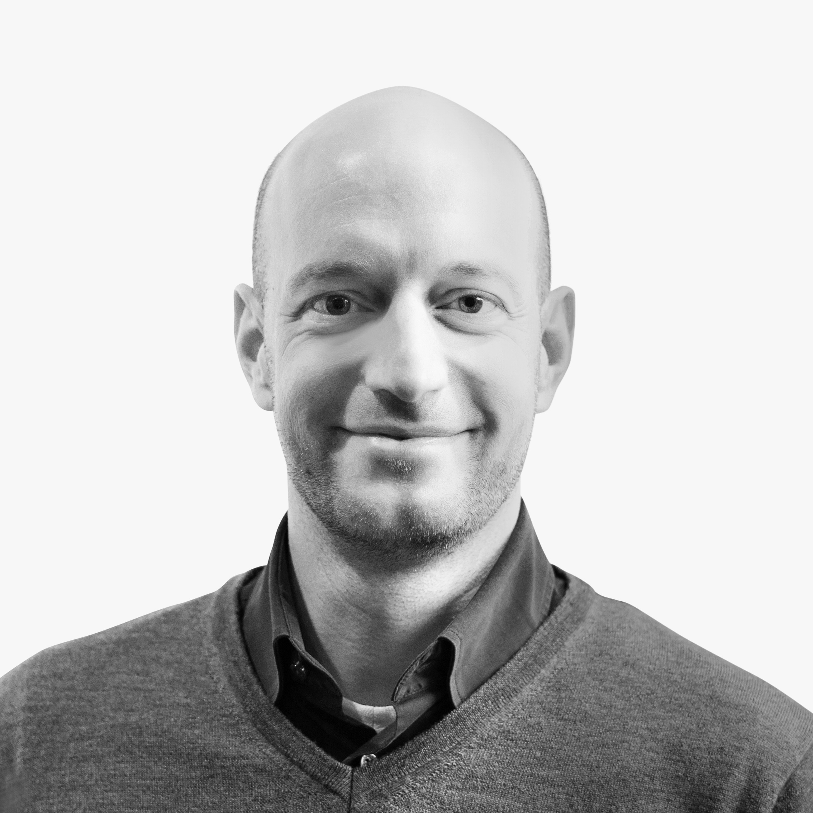
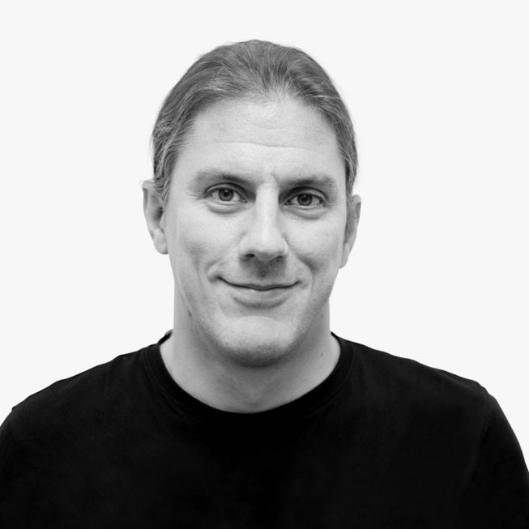

## Die Übersetzer

{width=20%,float=left}

*Michael Plöd* ist Principal Consultant bei INNOQ. Seine aktuellen Interessengebiete sind Microservices, Domain-driven Design, polyglotter Persistenz, Alternativen zu alt eingewachsenen Softwarearchitekturen, Event Sourcing und Präsentationstechniken für Entwickler und Architekten.

{width=20%,float=left}

~~~~~~~~

~~~~~~~~
*Sonja Scheungrab* arbeitet, nach Stationen bei mehreren Verlagen, bei
INNOQ als Allrounderin für Kreatives. Nebenbei studiert sie Informatik
an der Fernuni Hagen.
~~~~~~~~

~~~~~~~~

{width=20%,float=left}

*Christian Stettler* ist Senior Consultant und Architekt bei INNOQ.
Er entwickelt fachlich relevante Systeme mit verteilten, 
skalierbaren Architekturen. Sein Interesse gilt dabei den Ansätzen von 
Domain-driven Design, um ein umfassendes fachliches Verständnis zu 
erlangen und dieses durchgängig in Code zu giessen.

{width=20%,float=left}

*Eberhard Wolff* arbeitet als Fellow bei INNOQ und berät 
Kunden in Bezug auf Architekturen und Technologien. Sein
Schwerpunkt liegt auf modernen Architektur-Ansätzen. Er ist Autor von 
über hundert Artikeln und Büchern u.a. zu
Microservices, Microservice
Technologien und Continuous Delivery.
